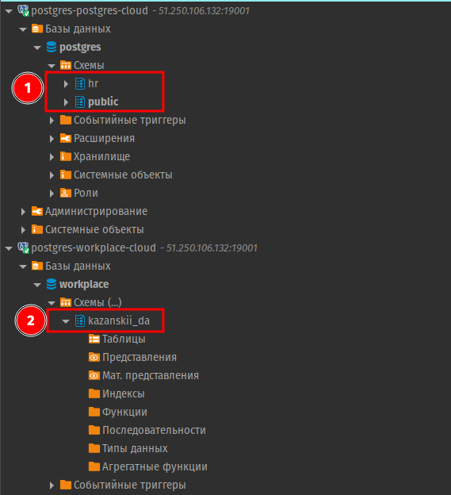
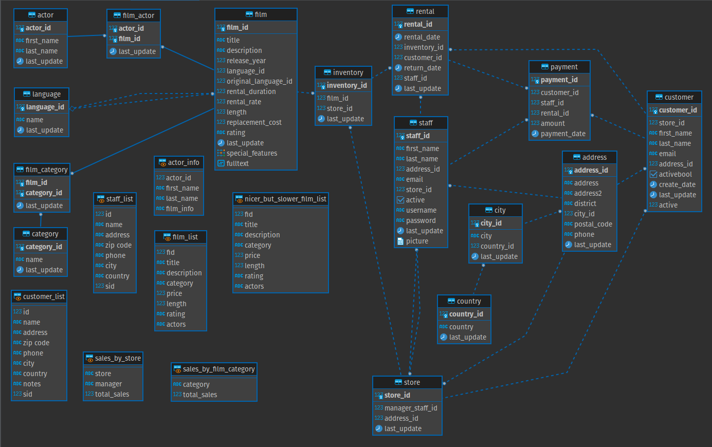
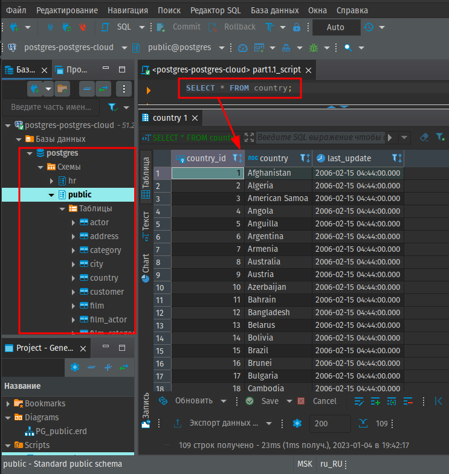

# Домашнее задание по теме "Введение в SQL. Установка ПО"


## Задание
**Преподаватель:** Алексей Кузьмин, Николай Хащанов, Екатерина Волочаева, Александр Сумовский

> Все работы мы проверяем на антиплагиат, поэтому важно выполнять их самостоятельно. Работам, которые не пройдут проверку, преподаватель поставит незачёт.

Если вы сталкиваетесь со сложностями, задавайте вопросы нашим экспертам и аспирантам, они с удовольствием вам помогут. Успехов в решении заданий!

**Модуль 1. Домашнее задание по теме «Введение в SQL и установка ПО»**

**Цель домашнего задания:**

-   научиться настраивать подключение к базе данных
-   научиться формировать ER-диаграмму таблиц базы данных
-   закрепить знания по определению первичных ключей для таблиц
-   написать и выполнить первый SQL-запрос

## **Перечень заданий:**

### **Основная часть:**  
---

**Задание 1. Создайте новое соединение в DBeaver и подключите облачную базу данных dvd-rental**



**Задание 2. Сформируйте ER-диаграмму таблиц базы данных dvd-rental**


**Задание 3. Перечислите все таблицы базы данных dvd-rental и поля, которые являются первичными ключами для этих таблиц.** 

Формат решения в виде таблицы [(пример)](https://letsdocode.ru/sql-m*ain/1-3.png) :

| **Название таблицы** | **Поле таблицы, которое является первичным ключом** |   
|  --- | --- | 
| actor	| actor_id| 
| address	| address_id| 
| category	| category_id| 
| city	| city_id| 
| country	| country_id| 
| customer	| customer_id| 
| film	| film_id| 
| film_actor	| actor_id, film_id| 
| film_category	| film_id, category_id| 
| inventory	| inventory_id| 
| language	| language_id| 
| payment	| payment_id| 
| rental	| rental_id| 
| staff	| staff_id| 
| store	| store_id| 

> [*How to list all primary keys in PostgreSQL database*](https://soft-builder.com/how-to-list-all-primary-keys-in-postgresql-database/)

**Задание 4. Выполните SQL-запрос к базе данных dvd-rental "SELECT * FROM country;"**  
Ожидаемый результат запроса: [(пример)](https://letsdocode.ru/sql-main/1-4.png)


```sql
SELECT  * 
FROM    country
;
```



### **Дополнительная часть:**  
---

**Задание 1. Выполните основную часть, развернув базу данных dvd-rental локально, используя сервер PostgreSQL Database Server и файл с дампом базы .backup или .sql**
> --
>

**Задание 2. С помощью SQL-запроса выведите названия ограничений первичных ключей.**  
Для написания запроса используйте представление information_schema.table_constraints:

```sql
SELECT 	constraint_name, table_name, table_schema
FROM 	information_schema.table_constraints
WHERE 	constraint_type in ('PRIMARY KEY')
;
```

|**constraint_name**|**table_name**|**table_schema**|
|---------------|----------|------------|
|actor_pkey|actor|public|
|address_pkey|address|public|
|category_pkey|category|public|
|city_pkey|city|public|
|country_pkey|country|public|
|customer_pkey|customer|public|
|film_actor_pkey|film_actor|public|
|film_category_pkey|film_category|public|
|film_pkey|film|public|
|inventory_pkey|inventory|public|
|language_pkey|language|public|
|payment_pkey|payment|public|
|rental_pkey|rental|public|
|staff_pkey|staff|public|
|store_pkey|store|public|

---

**Результат домашнего задания**  
В качестве ответов на основную часть необходимо прикрепить скриншот на каждый пункт задания. В качестве ответов на дополнительную часть необходимо прислать текст SQL-запросов в формате .sql

**Критерии оценки**  
Для зачета домашнего задания необходимо правильно выполнить все задания из основной части.

_Преподаватель вправе предложить дополнительные задачи в рамках задания, чтобы подтвердить, что студент разобрался в теме.  
Преподаватель вправе поставить незачет без права пересдачи текущего задания, если студент прислал на проверку результат чужой работы и отказался делать дополнительное задание._